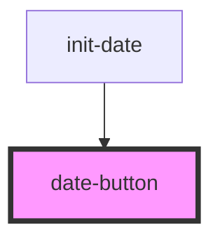

# date-button

<!-- Auto Generated Below -->

## Properties

| Property | Attribute | Description  | Type     | Default     |
| -------- | --------- | ------------ | -------- | ----------- |
| `data`   | `data`    | data to emit | `string` | `undefined` |

## Events

| Event      | Description   | Type                  |
| ---------- | ------------- | --------------------- |
| `emitDate` | event to emit | `CustomEvent<String>` |

## Dependencies

### Used by

 - [init-date](../init-date)

### Graph

----------------------------------------------

*Built with [StencilJS](https://stenciljs.com/)*
